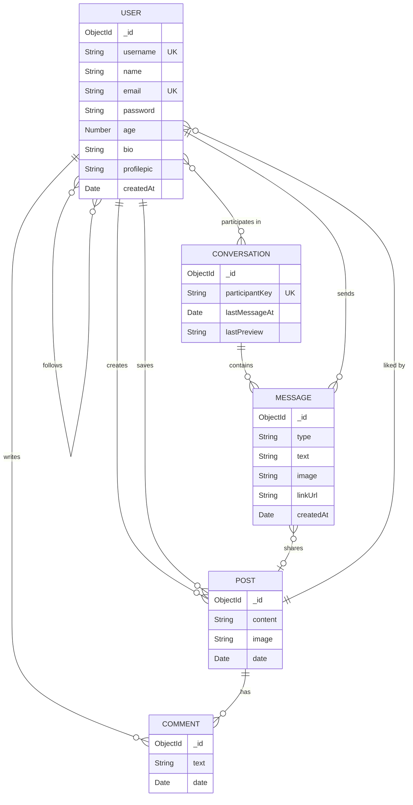

<div align="center">

# 🌐 SocialSphere

### *Connect · Share · Discover*

[](https://nodejs.org/)
[](https://expressjs.com/)
[](https://www.mongodb.com/)
[](https://ejs.co/)
[](https://opensource.org/licenses/ISC)

<br/>

A beautiful, full-stack social media platform built with **Express 5** and **MongoDB** — featuring glassmorphism design, dark / light themes, real-time messaging, an Instagram-style feed, and much more.

<br/>

[🚀 Quick Start](#-quick-start) · [✨ Features](#-features) · [🏗️ Architecture](#%EF%B8%8F-architecture) · [📡 API Routes](#-api-routes) · [🤝 Contributing](#-contributing)

</div>

---

## ✨ Features

<table>
<tr>
<td width="50%">

### 🔐 Authentication & Security
- Secure registration & login with **bcrypt** hashing
- **JWT**-based session management via HTTP-only cookies
- Auto-redirect for authenticated / unauthenticated users
- 7-day persistent sessions

</td>
<td width="50%">

### 📰 Feed & Posts
- Instagram-style chronological feed (latest 50 posts)
- Create text & image posts (up to 2 200 chars)
- Edit, delete, and update posts with images
- ❤️ Like / unlike toggle
- 💬 Threaded comments with delete support

</td>
</tr>
<tr>
<td>

### 👤 Profiles
- Custom profile pictures via **Multer** upload
- Editable bio (160 chars)
- Posts grid with like & comment overlays
- Follower / Following counts & lists
- View any user's profile at `/u/:username`

</td>
<td>

### 💬 Direct Messaging
- Full inbox with conversation list
- 1-on-1 real-time chat view
- Send **text**, **images**, **links**, and **shared posts**
- Auto-detected link messages
- Live message polling API

</td>
</tr>
<tr>
<td>

### 🔍 Search & Explore
- Regex-powered user & post search
- Explore page with trending users (by follower count)
- Discovery grid for all recent posts

</td>
<td>

### 🎨 UI / UX
- **Glassmorphism** design language
- 🌙 Dark / ☀️ Light theme toggle with persistence
- Stories bar, sidebar navigation, bottom nav (mobile)
- Smooth animations & micro-interactions
- Fully responsive — mobile, tablet, desktop

</td>
</tr>
<tr>
<td>

### 🔖 Save & Bookmark
- Save / unsave any post
- Dedicated "Saved Posts" page
- Quick-access from profile settings panel

</td>
<td>

### 👥 Social Graph
- Follow / unfollow any user
- Mutual follower/following tracking
- "People you may know" suggestions on feed

</td>
</tr>
</table>

---

## 🛠️ Tech Stack

| Layer        | Technology                                                                                                |
|:-------------|:----------------------------------------------------------------------------------------------------------|
| **Runtime**  | [Node.js](https://nodejs.org/) 18+                                                                        |
| **Framework**| [Express 5](https://expressjs.com/) — next-gen routing & middleware                                       |
| **Database** | [MongoDB](https://www.mongodb.com/) with [Mongoose 8](https://mongoosejs.com/) ODM                       |
| **Templating** | [EJS](https://ejs.co/) — server-side rendering with reusable partials                                  |
| **Auth**     | [bcrypt](https://www.npmjs.com/package/bcrypt) + [jsonwebtoken](https://www.npmjs.com/package/jsonwebtoken)|
| **Uploads**  | [Multer 2](https://www.npmjs.com/package/multer) — disk storage, 10 MB limit, image-only filter           |
| **Styling**  | Custom CSS with CSS variables, glassmorphism, dark/light themes                                           |
| **Icons**    | [Font Awesome](https://fontawesome.com/) 6                                                                |

---

## 🏗️ Architecture

```
┌──────────────────────────────────────────────────────────────┐
│                        Client (Browser)                      │
│   EJS Templates  ·  Custom CSS  ·  Vanilla JS (chat.js)     │
└────────────────────────────┬─────────────────────────────────┘
                             │  HTTP / Cookies (JWT)
┌────────────────────────────▼─────────────────────────────────┐
│                     Express 5  (app.js)                       │
│  ┌─────────┐  ┌───────────┐  ┌──────────┐  ┌─────────────┐  │
│  │  Auth   │  │   Feed    │  │ Profile  │  │  Messages   │  │
│  │ Middleware│  │  Routes   │  │ Routes   │  │  Routes     │  │
│  └─────────┘  └───────────┘  └──────────┘  └─────────────┘  │
│  ┌─────────┐  ┌───────────┐  ┌──────────┐                   │
│  │ Search  │  │  Explore  │  │  Social  │                   │
│  │ Routes  │  │  Routes   │  │ (Follow) │                   │
│  └─────────┘  └───────────┘  └──────────┘                   │
└────────────────────────────┬─────────────────────────────────┘
                             │  Mongoose ODM
┌────────────────────────────▼─────────────────────────────────┐
│                         MongoDB                              │
│   Users  ·  Posts  ·  Messages  ·  Conversations             │
└──────────────────────────────────────────────────────────────┘
```

---

## 📂 Project Structure

```
SocialSphere/
├── app.js                    # Main server — routes, middleware, DB connect
├── package.json
├── .env                      # Environment variables (see below)
│
├── config/
│   ├── defaults.js           # Default profile pic & legacy avatar migration
│   └── multerconfig.js       # Multer disk storage + image filter
│
├── models/
│   ├── user.js               # User schema (profile, social graph, saved posts)
│   ├── post.js               # Post + embedded Comment sub-schema
│   ├── conversation.js       # Conversation (1-on-1 DM threads)
│   └── message.js            # Message (text / image / link / shared post)
│
├── routes/
│   └── messages.js           # All /messages/* and /api/messages/* routes
│
├── views/
│   ├── index.ejs             # Registration page
│   ├── login.ejs             # Login page
│   ├── feed.ejs              # Home feed
│   ├── explore.ejs           # Explore / discover page
│   ├── search.ejs            # Search results
│   ├── profile.ejs           # User profile (own + others)
│   ├── profileupload.ejs     # Profile picture upload
│   ├── edit.ejs              # Edit post
│   ├── partials/
│   │   ├── head.ejs          # <head> meta, fonts, CSS
│   │   ├── sidebar.ejs       # Desktop sidebar navigation
│   │   ├── bottom-nav.ejs    # Mobile bottom navigation
│   │   ├── post-card.ejs     # Reusable post card component
│   │   ├── suggestions.ejs   # "People you may know" widget
│   │   ├── chat-bubble.ejs   # Chat message bubble component
│   │   └── settings-modal.ejs# Settings modal overlay
│   ├── messages/
│   │   ├── inbox.ejs         # Conversations list
│   │   └── chat.ejs          # Chat thread view
│   └── profile/
│       ├── saved.ejs         # Saved / bookmarked posts
│       └── settings.ejs      # Profile settings
│
└── public/
    ├── stylesheets/
    │   └── app.css           # Full design system (~35 KB)
    ├── javascripts/
    │   ├── app.js            # Theme toggle, file labels, UI helpers
    │   └── chat.js           # Real-time message polling & send
    └── images/
        └── uploads/          # User-uploaded images (gitignored)
```

---

## 📡 API Routes

### Authentication
| Method | Route          | Description                |
|:-------|:---------------|:---------------------------|
| `GET`  | `/`            | Registration page          |
| `POST` | `/register`   | Create account             |
| `GET`  | `/login`       | Login page                 |
| `POST` | `/login`       | Authenticate & set cookie  |
| `GET`  | `/logout`      | Clear session & redirect   |

### Feed & Posts
| Method | Route                    | Description                              |
|:-------|:-------------------------|:-----------------------------------------|
| `GET`  | `/feed`                  | Home feed (latest 50 posts)              |
| `POST` | `/post`                  | Create new post (text + optional image)  |
| `GET`  | `/like/:id`              | Toggle like on a post                    |
| `POST` | `/comment/:id`           | Add comment to a post                    |
| `POST` | `/comment/:postId/delete/:commentId` | Delete own comment           |
| `GET`  | `/edit/:id`              | Edit post form                           |
| `POST` | `/update/:id`            | Update post content / image              |
| `POST` | `/delete/:id`            | Delete own post                          |

### Profiles & Social
| Method | Route                 | Description                         |
|:-------|:----------------------|:------------------------------------|
| `GET`  | `/profile`            | Own profile                         |
| `GET`  | `/u/:username`        | Any user's profile                  |
| `POST` | `/profile/bio`        | Update bio                          |
| `GET`  | `/profile/upload`     | Profile picture upload page         |
| `POST` | `/upload`             | Upload new profile picture          |
| `GET`  | `/profile/saved`      | View saved / bookmarked posts       |
| `GET`  | `/save/:id`           | Toggle save / unsave a post         |
| `GET`  | `/follow/:id`         | Toggle follow / unfollow a user     |

### Search & Explore
| Method | Route          | Description                           |
|:-------|:---------------|:--------------------------------------|
| `GET`  | `/search?q=`   | Search users & posts by keyword       |
| `GET`  | `/explore`     | Explore page with trending users      |

### Direct Messages
| Method | Route                          | Description                              |
|:-------|:-------------------------------|:-----------------------------------------|
| `GET`  | `/messages`                    | Inbox — list all conversations           |
| `GET`  | `/messages/with/:username`     | Open chat thread with a user             |
| `GET`  | `/api/messages/:conversationId`| Polling API — fetch new messages (JSON)  |
| `POST` | `/messages/send`               | Send message (text / image / link / post)|

---

## 🚀 Quick Start

### Prerequisites

- **Node.js** ≥ 18
- **MongoDB** instance (local or [MongoDB Atlas](https://www.mongodb.com/cloud/atlas))

### 1 · Clone the repository

```bash
git clone https://github.com/Vidhya-Majee/SocialSphere.git
cd SocialSphere
```

### 2 · Install dependencies

```bash
npm install
```

### 3 · Configure environment variables

Create a `.env` file in the project root:

```env
MONGODB_URI=mongodb://localhost:27017/socialsphere
JWT_SECRET=your_super_secret_key_here
PORT=5000
```

> [!TIP]
> For production, use a strong random string for `JWT_SECRET`. Generate one with:
> ```bash
> node -e "console.log(require('crypto').randomBytes(64).toString('hex'))"
> ```

### 4 · Start the server

```bash
# Production
npm start

# Development
npm run dev
```

### 5 · Open in browser

```
http://localhost:5000
```

🎉 **That's it!** Register an account and start exploring.

---

## 📊 Data Models



---

## 🧩 Key Design Decisions

| Decision | Rationale |
|:---------|:----------|
| **Express 5** | Native `async` error handling, improved routing, future-proof |
| **EJS over React/Vue** | Server-rendered for simplicity — no build step, fast TTFB |
| **JWT in HTTP-only cookies** | XSS-resistant session storage, stateless backend |
| **Embedded comments** | Comments are always read with their parent post — avoids extra queries |
| **Conversation `participantKey`** | Unique sorted compound key ensures exactly one thread per user pair |
| **Multer disk storage** | Simple local file handling with crypto-random filenames to prevent collisions |
| **CSS custom properties** | Enables runtime dark / light theme toggle without reloading |

---

## 🤝 Contributing

Contributions are welcome! Here's how to get started:

1. **Fork** the repository
2. **Create** a feature branch
   ```bash
   git checkout -b feature/amazing-feature
   ```
3. **Commit** your changes
   ```bash
   git commit -m "feat: add amazing feature"
   ```
4. **Push** to the branch
   ```bash
   git push origin feature/amazing-feature
   ```
5. **Open** a Pull Request

> [!NOTE]
> Please follow [Conventional Commits](https://www.conventionalcommits.org/) for commit messages and open an issue before starting work on large changes.

---

## 📄 License

This project is licensed under the **ISC License** — see the [LICENSE](https://opensource.org/licenses/ISC) file for details.

---

<div align="center">

**Built with ❤️ by [Vidhya Majee](https://github.com/Vidhya-Majee)**

<sub>If you found this project helpful, consider giving it a ⭐ on GitHub!</sub>

</div>
