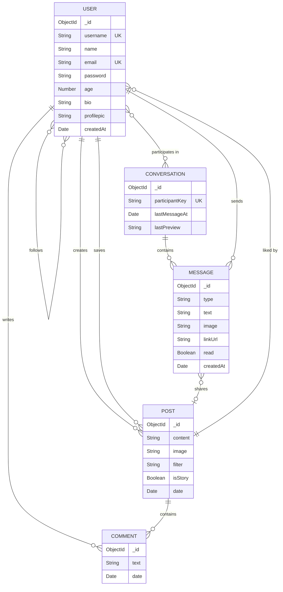
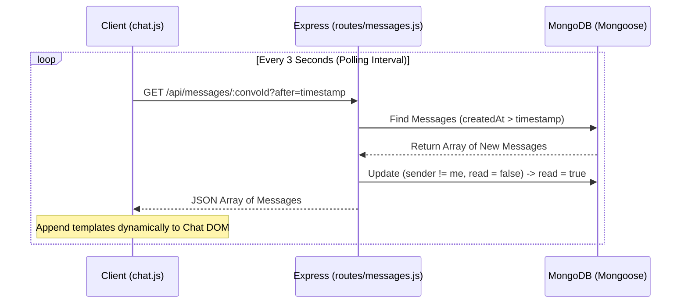

# 🌐 SocialSphere

### *Connect · Share · Discover*

<div align="center">

[](https://socialsphere-gav1.onrender.com)
[](https://nodejs.org/)
[](https://expressjs.com/)
[](https://www.mongodb.com/)
[](https://ejs.co/)
[](https://opensource.org/licenses/ISC)

<br/>

🚀 **Live Application:** [socialsphere-gav1.onrender.com](https://socialsphere-gav1.onrender.com)

<br/>

SocialSphere is a premium, full-stack social media application crafted with **Node.js**, **Express 5**, and **MongoDB (Mongoose 8)**. It features a modern, ultra-responsive glassmorphism interface, native support for light & dark modes, interactive image filters, self-destructing stories, real-time message polling, and comprehensive profile customization.

[🚀 Quick Start](#-quick-start) · [✨ Features](#-features) · [🧬 Data Architecture](#-data-architecture) · [🏗️ Design Decisions](#%EF%B8%8F-key-design-decisions) · [📡 Route Directory](#-route-directory)

</div>

---

## ✨ Features

### 📖 Immersive 24h Stories System
* **Add to Story**: Share image updates with optional text captions directly to your profile's story track.
* **Creative CSS Filters**: Apply filters (*Normal*, *Warm*, *Cool*, *Vintage*, *B&W*, *Sepia*, *Dramatic*) inline before posting.
* **Interactive Viewer**: Immersive fullscreen carousel experience featuring active user headers, chronological slide progress bars, click/tap left-right navigation, and instant direct replies.
* **Auto-Self-Destruct**: Automatic cron-like database sweeps that purge stories older than 24 hours from the database on every feed load.

### 📰 Interactive Chronological Feed
* **Multi-Media Composers**: Publish rich text and image posts with instant live image preview and custom filter rendering.
* **Real-time AJAX Likes**: Like and unlike posts instantly without page refreshes using an optimized REST handler.
* **Threaded Comments**: Engage in threads with full capabilities to append comments or delete your own contributions.
* **Quick-Share Engine**: An overlay modal for immediately sending any feed post as a DM card to following/suggested users.

### 💬 Real-Time Messaging & Direct Inbox
* **Consolidated Inbox**: Overview of active message threads sorted by latest activity, showcasing preview snippets and visual unread badges.
* **Rich 1-on-1 Chats**: Send standard text, attach images, or paste links to render auto-parsed hyperlink messages.
* **Shared Post Embeds**: Dynamically renders high-fidelity post attachments shared straight from the main feed.
* **AJAX Polling Loop**: Dynamic message synchronization engine using client-side `after` timestamp paging to fetch new messages seamlessly.

### 🎨 Premium Glassmorphism UI/UX
* **Dual Themes**: Complete light-to-dark stylesheet built on CSS custom variables, persisting user selection in local storage.
* **Mobile-First Layouts**: Reusable EJS layout structure featuring adaptive desktop sidebars, mobile headers, and bottom tab sheets.
* **Micro-interactions**: Subtle hover states, smooth transitions, loading skeletons, and interactive modal sheets.

---

## 🛠️ Technology Ecosystem

* **Backend Engine**: Node.js & Express 5 (features native `async` error handling and cleaner routing controllers).
* **Database & Modeler**: MongoDB Atlas & Mongoose 8 (utilizes strict typing, auto-population, and complex aggregations).
* **View Layer**: Embedded JavaScript (EJS) using nested layout partials (`head`, `sidebar`, `bottom-nav`).
* **Authentication**: JSON Web Tokens (JWT) stored in secure, stateless HTTP-only cookies with 7-day expiration.
* **Media Handling**: Multer storage backend with strict image MIME-type validation and deterministic unique file naming.

---

## 🧬 Data Architecture

SocialSphere relies on highly relational Mongoose models optimized for querying speed and sub-document integrity.



### Real-Time Message Synchronization Flow



---

## 🏗️ Key Design Decisions

| Architectural Component | Selected Pattern | Engineering Rationale |
| :--- | :--- | :--- |
| **Routing Architecture** | Express 5 Middleware | Eliminates manual try-catch wrappers for async controllers, reducing route boilerplate. |
| **Authentication Strategy**| HTTP-Only JWT Cookies | Safeguards against cross-site scripting (XSS) session theft while remaining completely stateless. |
| **Comments Schema** | Embedded Sub-documents | Stores comments directly inside the `POST` document since they are always fetched concurrently. |
| **Story Expiry sweeps** | JIT Feed Purging | Story database cleaning runs on-demand during `/feed` requests, removing the overhead of running persistent cron daemons. |
| **Conversation Keys** | Sorted `participantKey` | Compiles participant IDs alphabetically to prevent duplicate 1-on-1 message threads. |
| **Theme System** | Pure CSS Variables | Facilitates styling re-evaluation without needing front-end JS compiler frameworks. |

---

## 📂 Project Structure

```
SocialSphere/
├── app.js                    # Core server configuration, database connections & routing
├── package.json              # Dependency manifests & run scripts
├── .env                      # Application environment configurations
│
├── config/
│   ├── defaults.js           # Media fallbacks & default image handlers
│   └── multerconfig.js       # Disk upload configuration and image validation rules
│
├── models/
│   ├── user.js               # User document, follower relationships, & saved posts arrays
│   ├── post.js               # Feed/Story schemas, like tracks, & embedded comments
│   ├── conversation.js       # DM Thread maps with sorted participant keys
│   └── message.js            # Message documents supporting text, image, links, & post shares
│
├── routes/
│   └── messages.js           # Express endpoints & polling endpoints for messaging
│
├── views/
│   ├── index.ejs             # Registration interface
│   ├── login.ejs             # Access authorization portal
│   ├── feed.ejs              # Main portal with home timeline & Stories tray
│   ├── explore.ejs           # Grid discovery view & global member suggestions
│   ├── search.ejs            # Regex query result templates
│   ├── profile.ejs           # Profile views (support for self & external users)
│   ├── profileupload.ejs     # Profile picture upload template
│   ├── edit.ejs              # Post modification views
│   │
│   ├── partials/             # Reusable design partial snippets
│   │   ├── head.ejs          # Global CSS imports, Google Fonts, & metadata
│   │   ├── sidebar.ejs       # Desktop navigation deck
│   │   ├── bottom-nav.ejs    # Mobile layout utility navigation bar
│   │   ├── post-card.ejs     # Standardized content card for posts
│   │   ├── suggestions.ejs   # "People you may know" recommendation widget
│   │   ├── chat-bubble.ejs   # Context-aware chat templates (text, image, shared post)
│   │   └── settings-modal.ejs# Profile parameter modifications
│   │
│   └── messages/
│       ├── inbox.ejs         # DM thread index
│       └── chat.ejs          # Full-screen conversation thread EJS template
│
└── public/
    ├── stylesheets/
    │   └── app.css           # Global design system & theme sheets (~35 KB)
    └── javascripts/
        ├── app.js            # DOM control handlers, CSS filter selections, & modal toggles
        └── chat.js           # AJAX Message pollers & scroll managers
```

---

## 📡 Route Directory

### 🔐 Authentication Portal
* `GET  /` - Entry point; renders Registration page.
* `POST /register` - Registers new user with Bcrypt password hashing.
* `GET  /login` - Renders Login portal.
* `POST /login` - Processes verification, issues JWT cookie.
* `GET  /logout` - Destroys session cookies.

### 📰 Feed & Socialization
* `GET  /feed` - Renders user feed, purges stale stories, displays suggestions.
* `POST /post` - Creates text/media posts and stories with custom CSS filters.
* `GET  /like/:id` - REST API to toggle like status. Supports AJAX or standard redirects.
* `POST /comment/:id` - appends standard comment to specified post.
* `POST /comment/:postId/delete/:commentId` - Removes authorized comments.
* `GET  /edit/:id` - Form view to modify owned posts.
* `POST /update/:id` - Persists content modifications or switches images.
* `POST /delete/:id` - Deletes owned posts and clears referenced links.

### 👤 Profile Management
* `GET  /profile` - Displays current user’s stats, grid, and stories.
* `GET  /u/:username` - Public user profile pages.
* `POST /profile/bio` - Updates 160-character biography.
* `POST /profile/personal-info` - Updates age and gender attributes.
* `GET  /profile/upload` - Profile picture editing board.
* `POST /upload` - Stores uploaded avatar using Multer disk engine.
* `GET  /profile/saved` - Renders saved post listings.
* `GET  /save/:id` - Toggles saved bookmarks.
* `GET  /follow/:id` - Toggles follow state of specific target profiles.

### 🔍 Discovery & Messages
* `GET  /search?q=` - Case-insensitive regex query executor for posts and users.
* `GET  /explore` - Recommends trending creators (by follower count) and globally popular posts.
* `GET  /messages` - Renders inbox listing active threads.
* `GET  /messages/with/:username` - Opens chat interface, marks messages as read.
* `GET  /api/messages/:conversationId` - JSON stream endpoint used for message polling.
* `POST /messages/send` - Dispatches messages (supports files, text, hyperlinks, & shared post cards).

---

## 🚀 Quick Start

### Prerequisites
* **Node.js** v18 or higher.
* **MongoDB** (Local instance or an Atlas cloud connection).

### 1. Clone Project
```bash
git clone https://github.com/Vidhya-Majee/SocialSphere.git
cd SocialSphere
```

### 2. Install Dependencies
```bash
npm install
```

### 3. Environment Setups
Create a `.env` file in the root directory:
```env
MONGODB_URI=mongodb://localhost:36116/socialsphere
JWT_SECRET=secret_key_here
PORT=5000
```

> [!TIP]
> Generate a highly secure random string for `JWT_SECRET` using Node.js:
> ```bash
> node -e "console.log(require('crypto').randomBytes(64).toString('hex'))"
> ```

### 4. Run Server
```bash
# Production Mode
npm start

# Development Mode (Nodemon / Watcher)
npm run dev
```

### 5. Access
* **Local Development:** Launch your browser and head to:
  ```
  http://localhost:5000
  ```

* **Live Deployment:** Open your browser and navigate to:
  ```
  https://socialsphere-gav1.onrender.com
  ```

---

## 🤝 Contributing

Contributions make the open-source community an amazing place to learn, inspire, and create.

1. **Fork** the project repository.
2. **Branch** off into your feature deck:
   ```bash
   git checkout -b feature/awesome-feature
   ```
3. **Commit** your changes following standard guidelines:
   ```bash
   git commit -m "feat: integrate cool feature"
   ```
4. **Push** to the origin repository:
   ```bash
   git push origin feature/awesome-feature
   ```
5. **Open** a Pull Request for review.

---

## 📄 License

Licensed under the **ISC License** — see the [LICENSE](https://opensource.org/licenses/ISC) file for details.

<div align="center">

**Built with ❤️ by [Vidhya Majee](https://github.com/Vidhya-Majee)**

<sub>Show some love by adding a ⭐ to the repository!</sub>

</div>
